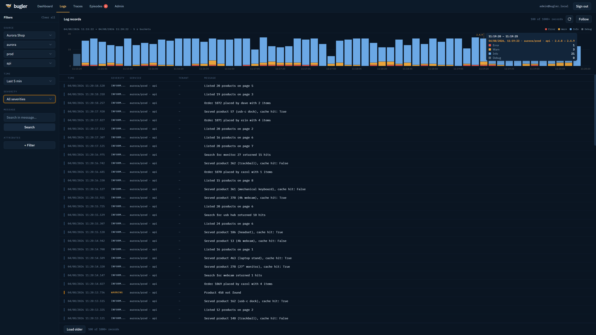
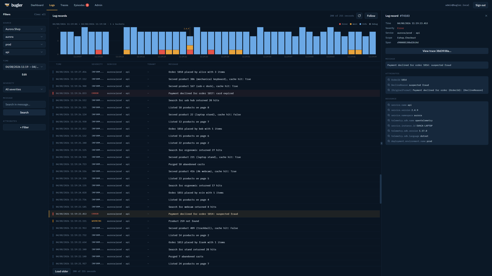
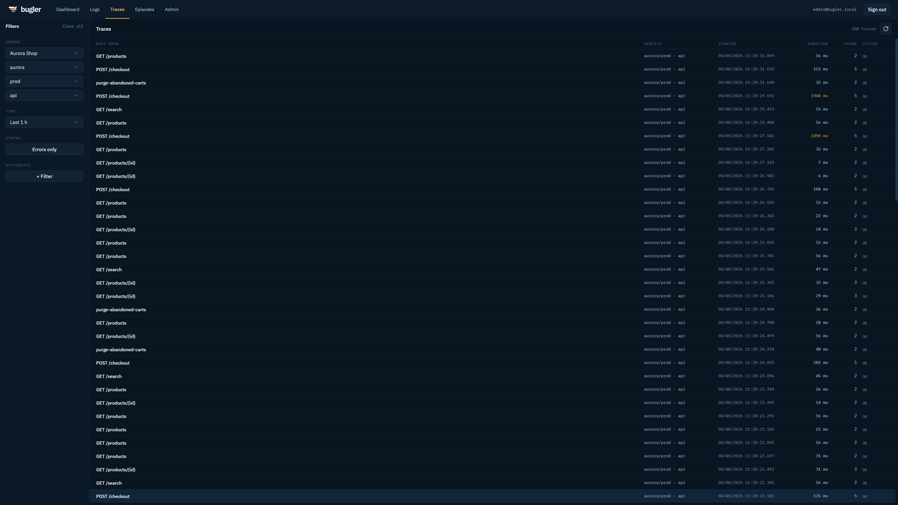
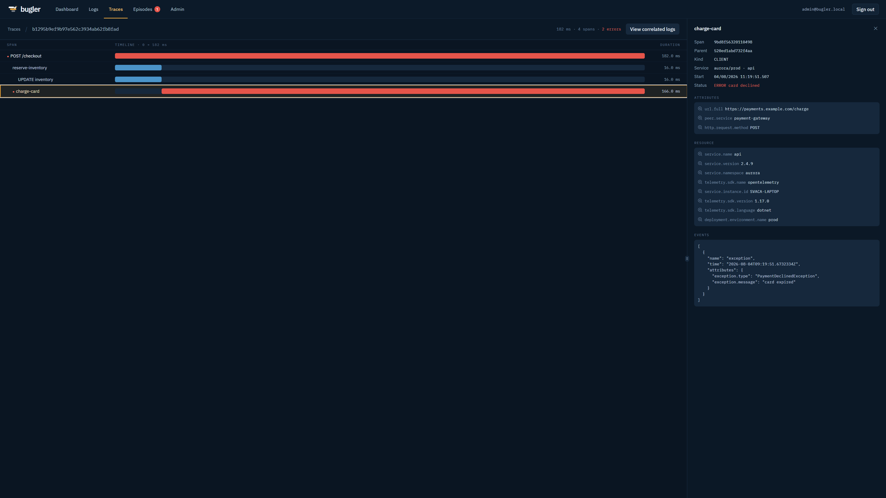
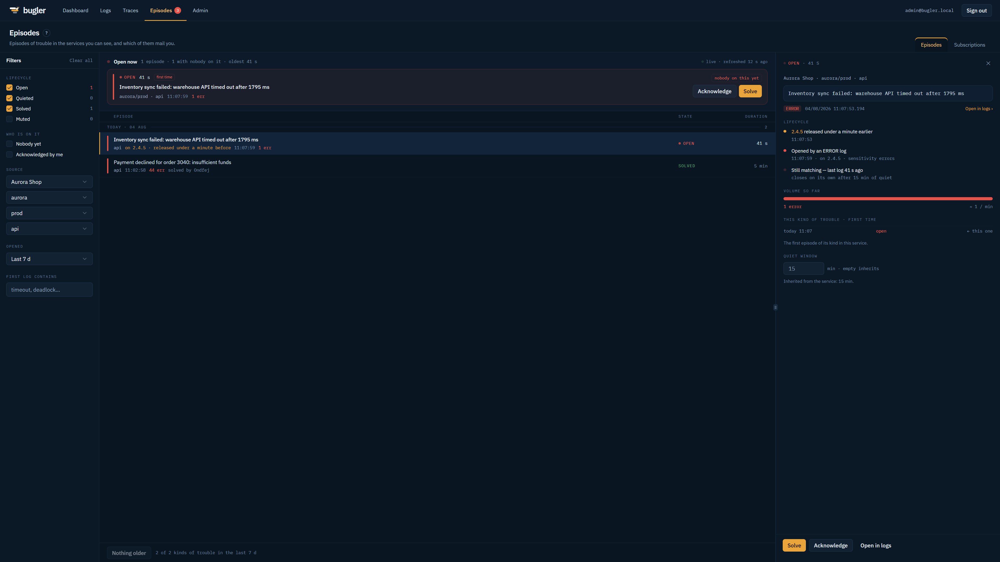
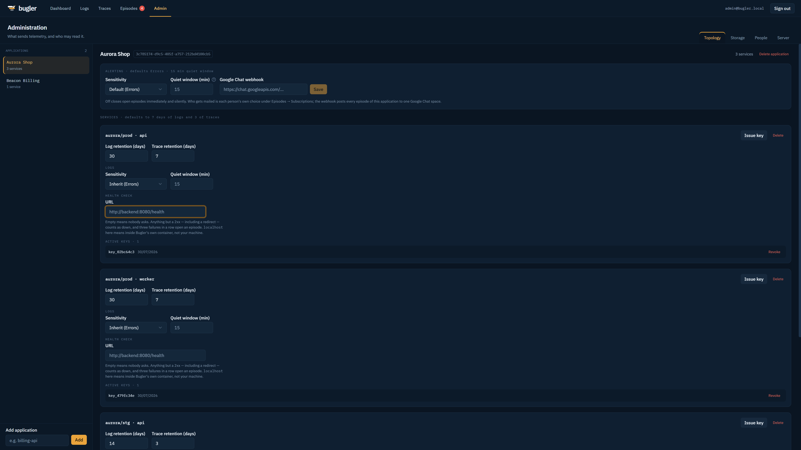
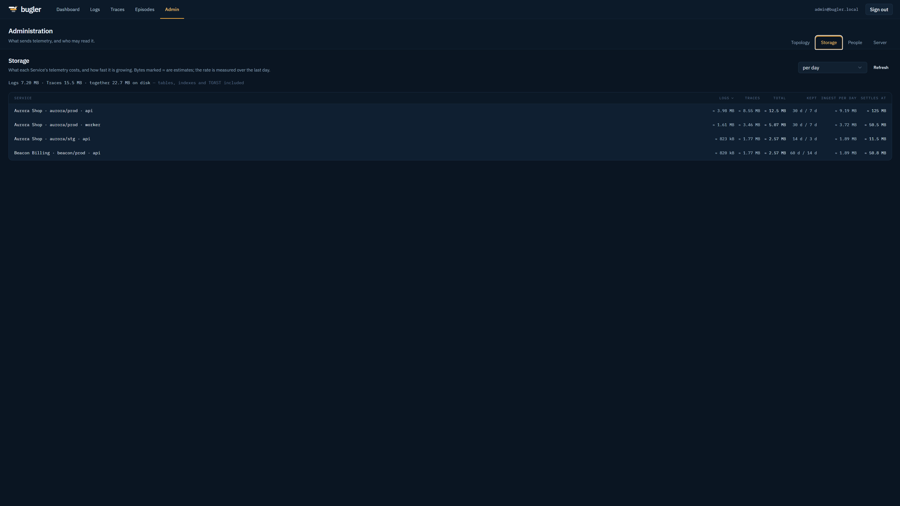
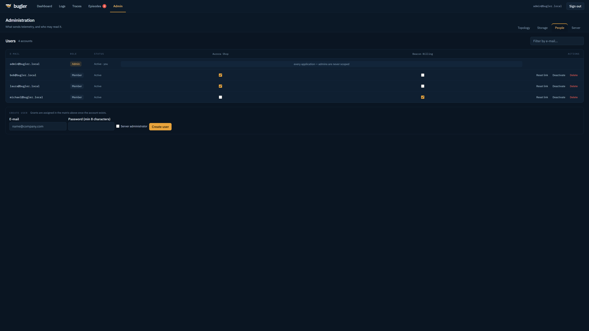

# Bugler

[](https://github.com/Svaca33/Bugler/actions/workflows/ci.yml)
[](LICENSE)

Self-hosted telemetry server: **logs and traces in over OTLP, an explore UI out**, and a mail or a
Google Chat message to whoever subscribed when a service starts logging trouble — with a language
model's reading of the evidence beside it, and a read-only door your coding agent can ask through.
One container, one PostgreSQL, no agent to install.

Built for the situation where a company runs **several applications, each deployed separately for
several clients**, and a team member may only see the telemetry of the applications they were
granted.



## Bugler in a minute

Your services export OpenTelemetry to Bugler; Bugler stores it, shows it, watches it, and answers
about it — to you at a browser, to your inbox, and to an agent at your editor:

```
  any OpenTelemetry SDK,             ┌─────────────────────┐
  any language                       │       Bugler        │ ──▶  explore UI          :8080
  authenticated by its API key  ───▶ │    one container    │ ──▶  alerts by mail / Google Chat
  OTLP :4317 gRPC / :4318 HTTP       │   + one PostgreSQL  │ ──▶  MCP for your agent  :8081
                                     └─────────────────────┘
```

What you get:

- **Explore without a query language** — click the filters, read the volume chart, follow the tail.
- **Traces attached to their logs** — one click from a span to the records written inside it, and back.
- **An unattended watch** — one *Episode* per kind of trouble, not one mail per log line.
- **An AI reading of that trouble** — two or three sentences on what is likely going on, written as
  the Episode opens and carried in the alert. Off until you configure a provider *and* consent per
  application; your own Ollama counts as a provider.
- **A door for your agent** — Bugler speaks MCP, read-only, so Claude Code or Cursor can read the
  production logs while you debug instead of you pasting them in.
- **Access granted per application** — local accounts, no identity provider; a member never learns
  the rest exist.
- **One container** — no sidecar, no broker, no object storage.

Metrics have no receiver yet; they are planned for a later phase.

## Try it in five minutes

Docker is all it takes — apart from the sample generator in step 4, which wants the .NET 10 SDK.

**1. Raise it.**

```bash
git clone https://github.com/Svaca33/Bugler.git
cd Bugler
docker compose up --build -d
```

That is Bugler, a PostgreSQL, and a mailpit that swallows every message so nothing reaches a real
inbox — read what Bugler sent at http://localhost:8025. It is meant for a laptop; on a server the
database and the relay already exist and belong to somebody else ([DEPLOYMENT.md](DEPLOYMENT.md)).

**2. Take the server.** Open http://localhost:8080 and register — **the first account created
becomes the administrator**, and nothing is seeded, so nobody else can take it first.

**3. Register a sender.** In **Admin → Topology**, add an Application, add a Service to it, and issue
that Service an API key. The key is shown once. It *is* the sender's identity
([ADR 0006](docs/adr/0006-service-is-the-sender-identity.md)) — one key per deployed role.

**4. Give it something to show.** Either point a service you already run at it:

```bash
OTEL_EXPORTER_OTLP_ENDPOINT=http://localhost:4317
OTEL_EXPORTER_OTLP_HEADERS="Authorization=Bearer blgr_..."
```

— see [Sending telemetry](#sending-telemetry), and read it before you debug anything, because the
two ways an exporter can be misconfigured both end in it dropping every batch in silence.

Or, with the .NET 10 SDK to hand, run the simulated e-shop that filled the screenshots on this page
— traces with correlated logs, a steady trickle of failures and a rarer one that opens and closes
Episodes of its own:

```bash
dotnet run --project tools/Bugler.SampleSource -- --api-key blgr_...
```

**5. Optional, and worth it: turn the reading on.** In **Admin → Server** give the AI card a provider
— an Anthropic API key, or an OpenAI-compatible base URL such as `http://localhost:11434/v1` for a
local Ollama — and press its test button, which asks the provider outright and prints what it said.
Then open the Application in **Admin → Topology** and switch on its **AI consent**, which is what
lets its telemetry be shown at all. The next Episode to open arrives with a reading attached; see
[The reading beside the evidence](#the-reading-beside-the-evidence).

**6. Optional: let your own agent in.** Open the door on **Admin → Server** — shut on a fresh server
— then issue yourself a machine delegation on your **Account** page, which prints the line to run:

```bash
claude mcp add --transport http bugler http://localhost:8081/mcp \
  --header "Authorization: Bearer blgrd_..."
```

Ask it what has been failing since the last release. See
[Letting your editor read the telemetry](#letting-your-editor-read-the-telemetry).

## What it does

- **Takes OTLP as it comes** — logs and traces, gRPC on `:4317` and HTTP on `:4318`, from any
  OpenTelemetry SDK or collector. A Service authenticates with its own API key, and that key is
  what decides whose telemetry this is — never what the payload claims about itself
  ([ADR 0006](docs/adr/0006-service-is-the-sender-identity.md)).
- **Explore without a query language.** Narrow by application, namespace, environment, service,
  severity, message or any attribute; the volume chart above the list answers "since when" before
  you have finished reading the first page, and marks the deployments that happened in the window.
  *Follow* keeps the newest at the top.
- **Traces that stay attached to their logs.** A waterfall per trace, every span with its
  attributes and events, and one click from a span to the log records written inside it — or from
  a log to the trace it belongs to.
- **An unattended watch.** Bugler polls what it stored, groups the same kind of trouble into an
  **Episode** rather than mailing every line, closes it after a quiet window, and mails or posts to
  Google Chat. Episodes can be acknowledged and solved, so a team can see who has it.
- **A machine's reading of the evidence.** As an Episode opens, Bugler asks a language model what is
  likely going on and stands its two or three sentences beside the evidence — in the alert and on
  the Episode, in every language Bugler speaks, labelled as machine-written. Two switches gate it,
  both off by default: a provider on the server, and the Application's consent to have its telemetry
  shown to one. *Solved* stays a human verdict; nothing generated ever acts on an Episode.
- **A read-only door for agents.** Bugler speaks **MCP** on a port of its own, with eight tools
  designed for a model rather than mirrored off the REST API, so an agent can search the log records
  and walk a trace itself. It is opened by an administrator and entered with a *machine delegation* —
  your own reading, lent to a tool, narrowable, revocable, expiring.
- **Access granted per application.** Local accounts, no identity provider required; the first
  account created becomes the administrator. A member sees exactly the applications they were
  granted, and nothing tells them the rest exist.
- **Retention, per service, in days** — separately for logs and for traces, with a storage ledger
  that says what each service costs today and what it will settle at.
- **Runs as one container.** No sidecar, no message broker, no object storage: a .NET 10 modular
  monolith serving the UI, the REST API, both OTLP surfaces and the machine door, over a single
  PostgreSQL.

### One log, and everything around it



A selected record shows what the sender attached to it — its own attributes, the resource that
declared it, the scope that wrote it — and, when it was written inside a span, the way into the
trace it belongs to.

### Traces, and back again



One line per trace, with the slow ones marked in passing.



The waterfall, the failing span, its attributes and the exception event exactly as it arrived — and
`View correlated logs`, which is the same journey as the previous screen in the other direction.

### Trouble, grouped and answerable



An Episode is one kind of trouble in one Service — not one log line. It records what opened it, at
which release, how loud it has been since, and who acknowledged it.

### Administration



Applications and their Services, retention for each, alerting sensitivity and quiet windows, health
checks, and the API keys — issued once and shown once.



What each Service's telemetry costs today, how fast it is growing, and what it will settle at once
its retention starts throwing the oldest away. Estimates are marked as estimates.



Who may read what, as a matrix. Administrators are never scoped; everybody else is.

## Running it in earnest

The `docker compose` above is a laptop arrangement. A real deployment reaches for a database and an
SMTP relay that already exist, publishes the ports it means to publish and no others, and puts a
proxy in front — [DEPLOYMENT.md](DEPLOYMENT.md) is that walk-through, including
[what is exposed where](DEPLOYMENT.md#what-is-exposed-where). Images are published to
`ghcr.io/svaca33/bugler`.

## Shape

- Single-process **modular monolith** (.NET 10, ASP.NET Core): OTLP ingest (gRPC :4317, HTTP :4318), REST API, the MCP server (:8081) and the frontend served from one container.
- **PostgreSQL** as the only backing store (telemetry + catalog + users).
- **React + TypeScript** frontend (Bun toolchain, shadcn/ui, TanStack Router/Query).
- Distributed via **Docker + docker-compose**.

## Domain

The domain hierarchy is **Application → Service → Tenant**:

- An *Application* is a product; user access is granted per application.
- A *Service* is one registered sender — one role of one deployment, identified by its namespace, environment and name (`demo/prod · backend`). It owns its API keys and retention, and its identity is what the key proves, never what the telemetry claims about itself ([ADR 0006](docs/adr/0006-service-is-the-sender-identity.md)).
- A *Tenant* is a customer inside a multi-tenant Service, visible only as a filter attribute in telemetry.

The codebase is split into five bounded contexts — **Ingestion**, **Exploration**, **Alerting**, **Registry**, **Access** — described in [CONTEXT-MAP.md](CONTEXT-MAP.md), each with its own glossary (`src/Bugler.<Context>/CONTEXT.md`). Mail and AI are transports every context may use rather than contexts of their own ([ADR 0011](docs/adr/0011-mail-leaves-through-a-shared-transport.md), [ADR 0027](docs/adr/0027-ai-completions-leave-through-a-shared-transport.md)). Architectural decisions are recorded as ADRs in [docs/adr](docs/adr).

## Mail

Bugler mails two things: alerts to whoever subscribed, and password-reset links. Without SMTP
both stay quietly off — Bugler runs fine, but alerts reach inboxes never and passwords cannot be
reset by link.

Configure it while running, in **Admin → Server**: server (hostname or IP), port, security mode,
credentials if the relay wants any, and the From address. Saving applies to the very next mail —
no restart. The same screen sends a test message to your own account address and reports what the
SMTP server actually said; use it, because a relay that refuses Bugler otherwise surfaces only in
the container log.

A bare internal relay is a first-class citizen: an IP for the server, security `None`, credentials
empty. The security modes:

| Mode | Meaning |
| --- | --- |
| `Automatic` | STARTTLS when the server offers it, plaintext when it does not — the default |
| `None` | plaintext on purpose, even if the server advertises STARTTLS |
| `StartTls` | STARTTLS or the send fails — refuses to downgrade |
| `ImplicitTls` | TLS from the first byte — the dedicated-port style, usually 465 |

Settings saved on the screen live in the database and win **whole** — never field by field — over
the `Mail:Smtp` configuration section from the first save until the screen's *Reset to server
configuration*; the screen always says which side is live
([ADR 0014](docs/adr/0014-smtp-settings-are-runtime-editable-and-stored-by-host.md)). A deployment
that keeps SMTP in the environment keeps working unchanged; these matter only while nothing was
ever saved in the UI:

```yaml
Mail__Smtp__Host: "smtp.example.com"  # empty = mail disabled
Mail__Smtp__Port: "587"
Mail__Smtp__Security: "Automatic"     # Automatic | None | StartTls | ImplicitTls
Mail__Smtp__Username: ""              # empty = no authentication
Mail__Smtp__Password: ""
Mail__Smtp__From: "bugler@example.com"
```

The SMTP password is write-only: once saved it is never shown again, only replaced or removed.
The `docker compose` of the quickstart ships a mailpit that swallows everything Bugler
sends — read it at http://localhost:8025.

## The reading beside the evidence

When an Episode opens, Bugler can ask a language model what is likely going on and keep its answer
beside the evidence: two or three sentences on the Episode's detail, carried into the alert mail and
the Google Chat message, written in every language Bugler speaks. It is labelled as machine-written
and it decides nothing — *Solved* stays a human verdict, and an Episode has at most one reading,
written once as it opens. Trouble that returns gets a fresh one with its new Episode.

**Two switches gate it, and either one alone sends nothing:**

| Switch | Where | Default |
| --- | --- | --- |
| The server has an AI provider | **Admin → Server**, the AI card | unset — AI off everywhere |
| The Application consents to its telemetry being shown to it | the Application's detail in **Admin → Topology** | off, for new and existing applications alike |

Consent is read at the moment the data would leave, never earlier and never cached across it, so
withdrawing it stops the very next disclosure
([ADR 0028](docs/adr/0028-telemetry-reaches-an-ai-provider-only-by-consent.md)). What leaves, for a
consenting Application: the opening log record with its attributes (stack traces included), the
Service's last ~25 log bodies before it, and its latest release version. Nothing else, and nothing
at all for an Application that has not consented.

Two providers stand behind one seam. **Anthropic**, or **any OpenAI-compatible endpoint** — the
second not for OpenAI's sake but so that an operator can point Bugler at their own Ollama or vLLM
and let nothing leave the building:

```yaml
Ai__Provider: "Anthropic"          # Anthropic | OpenAiCompatible
Ai__BaseUrl: ""                    # empty = the provider's own address; required for OpenAiCompatible
Ai__ApiKey: ""                     # may stay empty for a LAN endpoint that authenticates nobody
Ai__Model: "claude-haiku-4-5"      # e.g. claude-haiku-4-5, or llama3.1 on a local server
Ai__PatienceSeconds: "60"          # how long an alert waits for its reading; 0 = never wait
```

AI is **on** once those amount to a working provider — a model, plus a key for Anthropic or a base
URL for an OpenAI-compatible endpoint. Anything short of that is off everywhere, exactly as unset
SMTP means no mail; nothing fails at startup and no screen misleads you about it.

The card on **Admin → Server** edits all of it while running, and follows the mail card to the
letter ([ADR 0027](docs/adr/0027-ai-completions-leave-through-a-shared-transport.md)): what you save
wins **whole** over that configuration section until *Reset to server configuration*, the screen
always says which side is live, the API key is write-only, and the test button asks the **saved**
provider — never the form's unsaved edits — and prints what it actually answered.

*Patience* is the one setting with no counterpart in mail: an alert whose reading is still being
written is held back that long and then leaves without it, and a reading that finishes late still
reaches the Episode's detail. Set it to zero and alerts never wait at all. A hung provider therefore
costs Bugler unexplained alerts and nothing else — every AI feature degrades to silence, because
these are ornaments on Bugler and never load-bearing.

## Sending telemetry

Bugler is a plain OTLP endpoint. Anything that speaks the protocol can export to it — an
OpenTelemetry SDK in any language, a logging-library sink such as `Serilog.Sinks.OpenTelemetry`
or the OpenTelemetry Logback appender, or a Collector forwarding on your behalf. Bugler is not
involved in the choice.

| | |
| --- | --- |
| OTLP/gRPC | `:4317` — one address for every signal |
| OTLP/HTTP | `:4318` — `POST /v1/logs`, `POST /v1/traces` |
| Signals | **logs and traces**; metrics are not implemented yet |
| Authentication | `Authorization: Bearer blgr_…` on every export |
| Body | protobuf only — JSON-encoded OTLP is refused with `415` |

Those are the ports the server itself listens on, as plain HTTP. Behind a reverse proxy the address
senders are given is usually the hostname with no port at all, the proxy routing `/v1/logs`,
`/v1/traces` and the gRPC service paths to them — see
[DEPLOYMENT.md](DEPLOYMENT.md#what-is-exposed-where).

Register an Application and a Service in **Admin** and issue that Service an API key. The key *is*
the sender's identity: `service.name` and the rest of the resource attributes are stored and shown,
but never decide which Service the data belongs to ([ADR 0006](docs/adr/0006-service-is-the-sender-identity.md)).
One key per deployed role — reusing a key across two deployments merges their telemetry.

### The portable way

Every OpenTelemetry SDK reads these variables, so they work regardless of language or framework:

```bash
OTEL_EXPORTER_OTLP_ENDPOINT=http://your-server:4317
OTEL_EXPORTER_OTLP_HEADERS="Authorization=Bearer blgr_..."
# for OTLP/HTTP instead of gRPC:
#   OTEL_EXPORTER_OTLP_PROTOCOL=http/protobuf
#   OTEL_EXPORTER_OTLP_ENDPOINT=http://your-server:4318
```

Configuring an exporter in code works equally well — but read the next two sections first, because
both failure modes below are silent. An exporter that cannot deliver drops the batch and lets the
application run on; nothing appears in Bugler and nothing appears in your logs.

### Base address, or full signal path?

Exporters disagree about what an endpoint setting means, and the disagreement is invisible until
telemetry goes missing.

| Exporter | Give it |
| --- | --- |
| `OTEL_EXPORTER_OTLP_ENDPOINT`, any SDK | **base** — the SDK appends `/v1/logs`, `/v1/traces` itself |
| OpenTelemetry .NET, `OtlpExporterOptions.Endpoint` assigned in code | **full per-signal URL** — the SDK appends nothing |
| `Serilog.Sinks.OpenTelemetry` 4.x, `options.Endpoint` | **base** — the sink derives `LogsEndpoint`/`TracesEndpoint` |

Getting it wrong lands you on `/` or on `/v1/logs/v1/logs`; both answer `404`/`405` and the batch
is gone.

**With gRPC the question does not arise** — signals are routed by service name, so
`http://your-server:4317` is correct for every exporter. Prefer gRPC unless something forces HTTP.

### One setting shared by two exporters

Applications often export logs through one library and traces through another — a Serilog sink
beside an OTel SDK, for instance. If both read the *same* endpoint setting, a full HTTP path cannot
satisfy them: the exporter that appends nothing will send **traces and metrics to `/v1/logs`**.
Bugler decodes those as a malformed log batch and rejects the whole request with `400`, discarding
the genuine log records travelling in it. Give each exporter its own setting, or use gRPC.

### When nothing arrives

Check the status Bugler returned before suspecting Bugler:

| Status | Meaning |
| --- | --- |
| `401` / gRPC `UNAUTHENTICATED` | missing key, or no Service matches it |
| `404` / `405` | wrong path — only `POST /v1/logs` and `POST /v1/traces` exist |
| `415` | `Content-Type` is not `application/x-protobuf` |
| `400` | body is not a decodable OTLP payload *for that signal* |
| `503` / gRPC `UNAVAILABLE` | ingest buffer full; the exporter should retry |
| gRPC `UNIMPLEMENTED` | metrics — Bugler has no metrics receiver yet |

Exporters hide these by design, so turn their own diagnostics on: `Serilog.Debugging.SelfLog.Enable(…)`
for a Serilog sink, the equivalent self-diagnostics channel for your SDK. From Bugler's side, running
it with `Logging__LogLevel__Microsoft.AspNetCore=Information` logs every request with its status code,
which is usually the fastest way to see what a silent exporter is really sending.

A quick way to prove the server, the key and the network before blaming your application:

```bash
curl -i -X POST http://your-server:4318/v1/logs \
  -H "Content-Type: application/x-protobuf" \
  -H "Authorization: Bearer blgr_..." --data-binary ''
```

An empty body is a valid, empty OTLP request: `200` means the path and the key are good.

## Driving the REST API from a script

The REST API on `:8080` is the UI's own, and it authenticates with the Session cookie — not with a
Service API key, which is for exports only. A script that signs in and then changes something has to
send one header of its own:

```bash
curl -i -X POST https://bugler.example.com/api/auth/login \
  -H "Content-Type: application/json" \
  -H "Bugler-Request: 1" \
  -d '{"email":"you@example.com","password":"…"}'
```

`Bugler-Request` is required on every method that is not a read, its value is never looked at, and
without it the answer is `403`. It is what keeps a page on another origin from spending your Session:
such a page can make your browser send the cookie, but it cannot make it send a header
([ADR 0025](docs/adr/0025-a-mutation-names-itself.md)). Reads need nothing.

## Letting your editor read the telemetry

Bugler speaks **MCP** on a port of its own, `:8081`, so an agent — Claude Code, Cursor — can read
your production logs while you debug instead of you pasting them in. It is read-only, and nothing
that can write exists on it at all.

Two things have to be true before it answers. An administrator opens the door on
**Administration → Server** — it is shut on a fresh server — and you issue yourself a **machine delegation**
under your own account. A machine delegation is your reading lent to a tool: never wider than what you may
read, narrowable to a single application, revocable at any moment, and expiring on its own.

```bash
claude mcp add --transport http bugler https://bugler.example.com/mcp \
  --header "Authorization: Bearer blgrd_..."
```

The eight tools are designed for a model rather than derived from the REST API the SPA uses
([ADR 0031](docs/adr/0031-the-tool-set-is-a-shape-of-its-own-not-a-mirror.md)) — `browse_catalog`,
`list_episodes`, `get_episode`, `search_log_records`, `get_log_record`, `list_observed_keys`,
`list_releases`, `get_trace`. Their answers are budgeted in tokens rather than screenfuls, they are
described in the same ubiquitous language the `CONTEXT.md` glossaries define, and they **never
truncate in silence**: every answer says how many records the filter matched, because an agent handed
fifty of four thousand errors and told nothing will conclude in writing that the problem is marginal.
Registry and Access are not served — this door answers for telemetry, never for the administration of
the server.

No AI call is ever made *by* Bugler here, and this door is deliberately **not** gated by the
Application's AI consent
([ADR 0032](docs/adr/0032-consent-governs-what-bugler-discloses-not-what-a-person-takes.md)): consent
governs what Bugler discloses on its own initiative to the provider its operator configured, whereas
here a person exercises their own reading, at their own keyboard, through a client whose model Bugler
never learns of. The gates that fit this actor are the ones above — the administrator's switch, the
delegation's narrowing and expiry, and the administrator's sight of every delegation issued with the
power to revoke any. What travels is bounded in kind too: a Reading leaves labelled as a machine's
reading of evidence rather than as evidence, so nothing a model wrote re-enters another model
wearing the clothes of fact.

Publishing that port is a separate decision from publishing the UI: leave it unrouted at your proxy
and the door simply cannot be reached from outside, however many machine delegations exist
([ADR 0030](docs/adr/0030-the-machine-door-is-a-surface-of-its-own.md)).

## Development

Prerequisites: .NET 10 SDK, Bun, Docker.

```bash
docker compose up -d          # local PostgreSQL
dotnet run --project src/Bugler.Host
cd frontend && bun dev        # frontend dev server with HMR
```

The Host listens on `:8080` (API/UI), `:4317` (OTLP/gRPC), `:4318` (OTLP/HTTP), and `:8081` (MCP). Database schema migrates automatically at startup. Each process authenticates its exports with its Service API key as a bearer token, e.g. `OTEL_EXPORTER_OTLP_HEADERS="Authorization=Bearer blgr_..."`.

### Tests

| Layer | Where | Run |
| --- | --- | --- |
| Unit (backend) | `tests/Bugler.<Context>.Tests` | `dotnet test` |
| Architecture | `tests/Bugler.ArchitectureTests` (ArchUnitNET) + `frontend/.dependency-cruiser.cjs` | `dotnet test` / `bun run arch` |
| Integration (real PostgreSQL via Testcontainers) | `tests/Bugler.IntegrationTests` | `dotnet test` (needs Docker) |
| Unit (frontend) | `frontend/**/*.test.tsx` | `bun test` |
| E2E (Playwright) | `e2e/tests` | `cd e2e && bun run test` (needs `docker compose up -d postgres`) |

Architecture tests enforce the context boundaries described in [CONTEXT-MAP.md](CONTEXT-MAP.md); a dependency that crosses a context boundary outside its `Contracts` namespace fails the build.

## Status

The whole path is implemented and runs: OTLP ingest of logs and traces, the explore UI,
applications, services, API keys and retention, local accounts with per-application grants, the
alerting watch with its mail and Google Chat notifications, the AI reading that rides along with an
alert, and the MCP door with its machine delegations.

Metrics have no receiver yet, and the version says what it says: Bugler is still on `0.x`, because
it has not been run in enough places for `1.0` to be an honest number. Until it is, a minor version
may move configuration or the database schema underneath you; read the release notes before
upgrading.

The current version is whichever is newest under
[Releases](https://github.com/Svaca33/Bugler/releases) — deliberately not repeated here, since a
number written into the repository is made stale by the very commit that writes it.

## Contributing and support

Bugler is written and maintained by one person in their own time. Issues are read, and none of the
usual promises follow from that: there is no response time, no service level, and no guarantee that
a request will be built. Saying so plainly seems better than letting anyone find out by waiting.

Bug reports and questions are welcome as [issues](https://github.com/Svaca33/Bugler/issues). A pull
request that fixes a typo, the documentation, or a contained bug can arrive without asking; anything
that changes behaviour wants an issue first, so that the shape can be agreed before you spend an
afternoon on it. [CONTRIBUTING.md](CONTRIBUTING.md) has the detail, including what the build
enforces about context boundaries and translated strings.

Found a vulnerability? Not in an issue, please — [SECURITY.md](SECURITY.md) says where.

## Licence

Bugler is licensed under the [Apache License 2.0](LICENSE). You may run it, modify it and
distribute it, including commercially, provided you keep the copyright notices and state what you
changed. It comes with no warranty of any kind. Third-party material Bugler carries — the
OpenTelemetry protocol definitions and the IBM Plex typefaces — is listed in [NOTICE](NOTICE).

### The name

The licence covers the code, not the name. **"Bugler" and the Bugler logo are not licensed** under
Apache 2.0 and remain the author's. A fork is welcome to exist, and must call itself something
else — so that nobody installing "Bugler" has to wonder whose it is, and so that its bugs land in
its own tracker.
